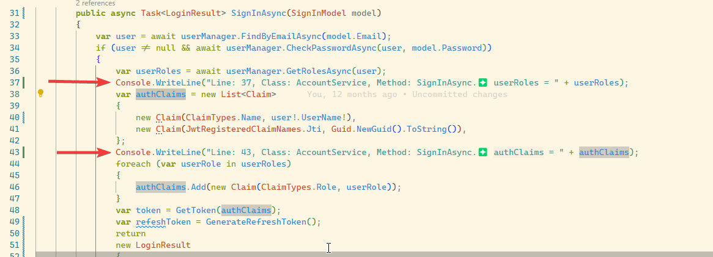

# Log C# Variable



## Overview
Log C# Variable is a Visual Studio Code extension that allows developers to quickly insert `Console.WriteLine` statements for debugging C# variables.

## Features
- Automatically inserts `Console.WriteLine` for selected variables.
- Includes file name, line number, class, and function name in the log message.

## Installation
1. Open Visual Studio Code.
2. Go to Extensions (`Ctrl+Shift+X`).
3. Search for **Log C# Variable**.
4. Click **Install**.

Alternatively, install via command line:
```sh
code --install-extension log-c#-variable
```

## Usage
1. Select a variable or expression in a C# file.
2. Press `F6` to insert a `Console.WriteLine` statement.

## Default Keybinding
- **F6**: Insert `Console.WriteLine` for selected text.

## Repository
For issues and contributions, visit our GitHub repository: [GitHub Repo](https://github.com/alexnguyen03/Log-Csharp-Variable)

## License
MIT License

