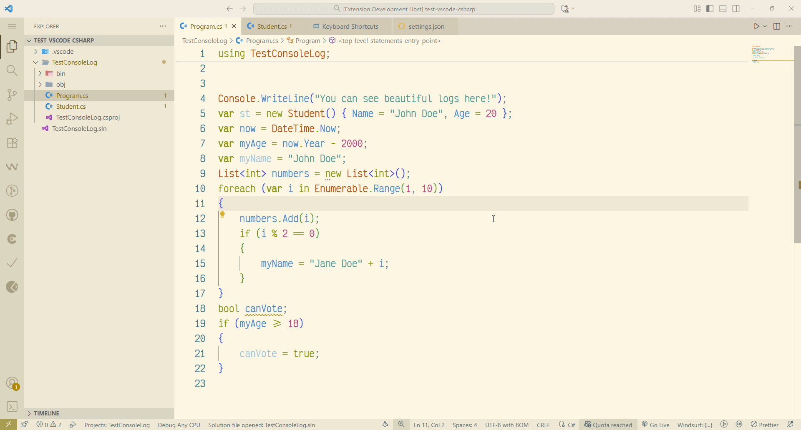
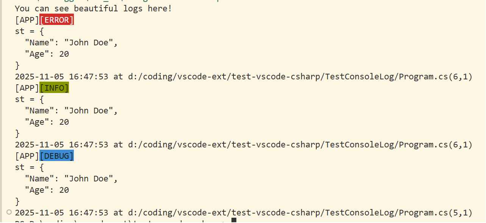
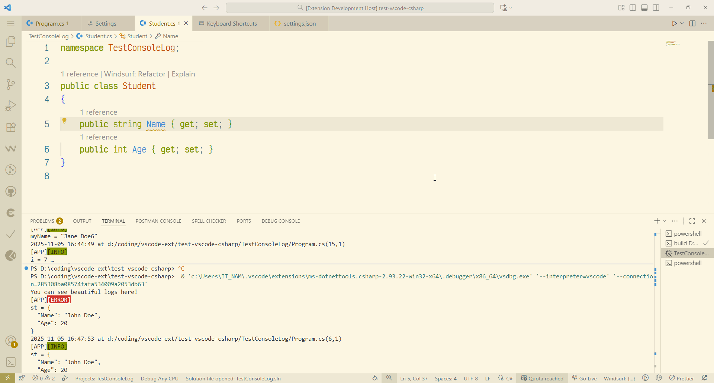

    

# LogCSharpVariable – Smart C# Debug Logger

[](https://marketplace.visualstudio.com/items?itemName=alexnguyeen03.log-csharp-variable)
[](https://marketplace.visualstudio.com/items?itemName=alexnguyeen03.log-csharp-variable)
[](https://marketplace.visualstudio.com/items?itemName=alexnguyeen03.log-csharp-variable&ssr=false#review-details)
[](LICENSE)
[](https://github.com/alexnguyen03/Log-Csharp-Variable/stargazers)

> Fast, safe, beautiful, and fully customizable to log your 🐞.

**Main feature:**


**Console:**



**Variable navigator:** Using `Ctrl + click` in path to navigate to variable definition



---

## Features

| Feature                             | Description                                                                   |
| ----------------------------------- | ----------------------------------------------------------------------------- |
| **Variable navigator**        | No selection needed — just place cursor on a variable and press `F6`.      |
| **Multi-log with `Ctrl+D`** | `Ctrl+D` to add matches → `F6` → logs **all instances**.          |
| **Smart JSON serialization**  | Objects →`JsonSerializer.Serialize(...)` with `Indented`/`SingleLine`. |
| **Custom log template**       | Use `{prefix}`, `{type}`, `{varLine}`, `{pathLine}`, `{timeLine}`.  |
| **ANSI-colored console**      | `DEBUG` (cyan), `INFO` (green), `ERROR` (red) — toggleable.            |
| **Auto-format & indent**      | Code stays clean and consistent.                                              |
| **Toggle generated logs**     | `Ctrl+F6` → comment/uncomment all logs from this extension.                |
| **100% safe insertion**       | Never breaks `{`, `if`, `foreach`, `catch`, etc.                      |

---

## Installation

### Option 1: VS Code Marketplace *(Recommended)*

1. Open **Extensions** (`Ctrl+Shift+X`)
2. Search: **`LogCSharpVariable`**
3. Click **Install**

### Option 2: From `.vsix`

```bash
code --install-extension logcsharpvariable-1.0.0.vsix
```

---

## Usage

### 1. Log a variable

- **Select** a variable → press **`F6`**
- Pick log level: `DEBUG` / `INFO` / `ERROR`
- Log is inserted, formatted, and colored in integrated terminal

### 2. Log multiple variables

- Cursor on first occurrence → press **`Ctrl+D`** to select next (*)
- Press **`F6`** → logs **all selected matches**

> (*) If your IDE not set yet, find `Add Selection to Next find match` in keyboard setting

### 3. Toggle logs

- Press **`Ctrl+F6`** → enable/disable all generated logs

## Keybindings

| Shortcut                                                | Action                    |
| ------------------------------------------------------- | ------------------------- |
| `F6`                                                  | Log variable under cursor |
| `Ctrl+F6`                                             | Toggle Generated Log      |
| `Ctrl+Shift+P` → `Log C# Variable: 💫Go to Settings` | Access extension settings |

## Template Examples

```text
{prefix}{type}
{varLine}
{timeLine} at {pathLine}
```

**Result:**

```plain
[APP][ERROR]
st = {
  "Name": "John Doe",
  "Age": 20
}
2025-11-05 16:21:29 at d:/coding/vscode-ext/test-vscode-csharp/TestConsoleLog/Program.cs(8,1)
```

## Commands

| Command                                     | Description |
| ------------------------------------------- | ----------- |
| `LogCSharpVariable: Log Variable`         | `F6`      |
| `LogCSharpVariable: Toggle Generated Log` | `Ctrl+F6` |

---

## Requirements

- **VS Code**: `^1.96.2`
- **Language**: C# (`.cs` files)
- **.NET**: `^6.0` (for `System.Text.Json`)

---

## Changelog

[Please view in github](https://github.com/alexnguyen03/Log-Csharp-Variable/blob/main/CHANGELOG.md)

## Contributing

Bug? Feature request?
[GitHub Repository](https://github.com/alexnguyen03/Log-Csharp-Variable)

```bash
git clone https://github.com/alexnguyen03/Log-Csharp-Variable.git
cd Log-Csharp-Variable
code .
```

---

## Support the Project (Coming soon)

Love **Log CSharp Variable**? Help keep it alive!

[](https://www.buymeacoffee.com/alexnguyen03)
[](https://ko-fi.com/alexnguyen03)
[](https://paypal.me/alexnguyen03)

Your support funds:

- New features (ILogger, Serilog, Blazor)
- Bug fixes & performance
- Docs & tutorials

---

## Contact Me

Have a question, suggestion, or just want to say hi?

| Platform | Link |
|--------|------|
| **Email** | [nguyenhoainam121n@gmail.com](mailto:nguyenhoainam121n@gmail.com) |
| **GitHub** | [@alexnguyen03](https://github.com/alexnguyen03) |
| **LinkedIn** | [Nam Nguyen](https://www.linkedin.com/in/nam-nguyen-219490269) |

## License

[MIT License](LICENSE) © 2025 Alex Nguyen

**Happy debugging!**

[def]: media/main-feat.gif
[def2]: media/navigator.gif
[def3]: media/demo-console.png
